# Agentic AI Gateway — User Manual

**Audience:** developers who connect applications and coding agents to the
gateway, and operators who install, configure, and run it.

**Version:** September 2026

---

## Contents

1. [What the gateway does](#1-what-the-gateway-does)
2. [Key concepts](#2-key-concepts)
3. [Installing and starting the gateway](#3-installing-and-starting-the-gateway)
4. [First-time setup](#4-first-time-setup)
5. [Connecting applications](#5-connecting-applications)
6. [Gateway request options](#6-gateway-request-options)
7. [Grounding answers in your documents (RAG)](#7-grounding-answers-in-your-documents-rag)
8. [Letting the gateway run tools (MCP)](#8-letting-the-gateway-run-tools-mcp)
9. [Using the console](#9-using-the-console)
10. [Configuring models and routing](#10-configuring-models-and-routing)
11. [Controlling cost and access](#11-controlling-cost-and-access)
12. [Guardrails](#12-guardrails)
13. [Semantic cache](#13-semantic-cache)
14. [Monitoring](#14-monitoring)
15. [Errors and what to do about them](#15-errors-and-what-to-do-about-them)
16. [Troubleshooting](#16-troubleshooting)
17. [Reference: settings](#17-reference-settings)

---

## 1. What the gateway does

The Agentic AI Gateway sits between your AI applications and the large language
model (LLM) providers they use. Your applications talk to **one API**; the
gateway talks to OpenAI, Anthropic, Google Gemini, and Ollama on their behalf.

Along the way it:

- **keeps requests succeeding** when a provider fails, by retrying and falling
  back to another provider;
- **chooses the best provider** for each request, by cost, speed, weight, or
  priority;
- **caches answers** to repeated or near-identical questions;
- **enforces budgets and rate limits** per API key and per team;
- **screens prompts and answers** for personal data and unsafe content;
- **grounds answers in your documents** (RAG) and **runs tools** for the model
  (MCP);
- **records every request**, with cost, latency, and the route it took.

Applications written for the OpenAI or Anthropic SDKs work unchanged: you only
change the base URL and the API key.

---

## 2. Key concepts

| Term | Meaning |
|---|---|
| **Model name** | The name clients ask for, such as `gpt-4o`. It is a *gateway* name defined in `config/models.yaml`, and it can point at any provider. |
| **Deployment** | One concrete way to serve a model name: a provider, an upstream model, credentials, and routing settings. A model name can have several deployments. |
| **Virtual key** | An API key (`sk-…`) issued by the gateway to an application. It carries a budget, rate limits, and a list of allowed models. Provider keys are never handed to applications. |
| **Master key** | The root key set in `MASTER_KEY`. It bypasses virtual-key limits. Keep it for administration only. |
| **Team** | A group of virtual keys sharing one budget. |
| **Console account** | An email and password for a human using the web console. Console accounts and virtual keys are separate; neither works in place of the other. |
| **Fallback** | Trying a different deployment after one fails. |
| **Guardrail policy** | A named set of rules that block, redact, or flag content. |

---

## 3. Installing and starting the gateway

### What you need

- **Postgres 16** for durable data (keys, logs, users).
- **Redis Stack** (not plain Redis): the cache and RAG need its vector search.
- At least one provider: an API key for OpenAI, Anthropic, or Gemini, or a
  running Ollama server. The gateway starts with whatever is configured.

### Option A: Docker Compose (recommended for a first run)

```bash
cp .env.example .env            # add your provider keys and secrets
docker compose -f deploy/docker/compose.yaml up -d
```

This starts the gateway on port **8000**, with Postgres, Redis Stack,
Prometheus (9090), Grafana (3000), and Ollama (11434).

### Option B: from source

```bash
uv venv --python 3.12
uv pip install -e ".[dev]"
cp .env.example .env
docker compose -f deploy/docker/compose.yaml up -d   # datastores
uv run aigateway migrate                             # create the schema
uv run aigateway serve --port 4000
```

### Option C: Kubernetes

A Helm chart is in `deploy/helm/aigateway`. It runs database migrations in an
init container before each release. Provide provider keys, `MASTER_KEY`, and
`JWT_SECRET` as Kubernetes secrets.

### Checking that it is up

| URL | Expected |
|---|---|
| `/healthz` | `200` — the process is alive |
| `/readyz` | `200` — the database and Redis are reachable |
| `/ui` | The console sign-in page |

> **Port numbers in this manual.** Examples use `localhost:4000` (running from
> source). The Docker image listens on `8000`.

---

## 4. First-time setup

### 4.1 Set the secrets

Before exposing the gateway, set these in `.env` or your secret store:

| Setting | Why |
|---|---|
| `MASTER_KEY` | Root API key. Anyone holding it can do anything. |
| `JWT_SECRET` | Signs console sessions. Use at least 32 random bytes, and the same value on every replica. |
| `BOOTSTRAP_ADMIN_EMAIL` / `BOOTSTRAP_ADMIN_PASSWORD` | Creates the first console administrator, only when no console accounts exist. |

If `BOOTSTRAP_ADMIN_PASSWORD` is left at its default of `admin`, the gateway
logs a security warning at startup. Change it.

### 4.2 Create the first administrator from the command line (production)

This keeps the password out of the running process's environment:

```bash
aigateway create-admin --email admin@example.com --password "$ADMIN_PASSWORD" --role admin
```

### 4.3 Issue a key for your first application

From the console (**Keys → Create key**, see section 9.6), or from the command line:

```bash
aigateway create-key --name my-app --budget 25 --rpm 60 --model gpt-4o
```

The full key is printed **once**. Only a hash is stored, so copy it now.

### 4.4 Command-line reference

| Command | Purpose |
|---|---|
| `aigateway migrate` | Create or upgrade the database schema |
| `aigateway db-stamp` | Adopt a database created before migrations were used |
| `aigateway create-admin` | Create a console account |
| `aigateway create-key` | Mint a virtual key (`--budget`, `--rpm`, `--model` repeatable) |
| `aigateway routes` | List the gateway's HTTP routes |
| `aigateway serve` | Run the gateway (`--port`, `--reload`) |

---

## 5. Connecting applications

### 5.1 OpenAI-compatible clients

**Endpoints:** `/v1/chat/completions`, `/v1/completions`, `/v1/embeddings`,
`/v1/models`

**Authentication:** `Authorization: Bearer <virtual key>`

```python
from openai import OpenAI

client = OpenAI(base_url="http://localhost:4000/v1", api_key="sk-your-virtual-key")
reply = client.chat.completions.create(
    model="gpt-4o",
    messages=[{"role": "user", "content": "Hello"}],
)
print(reply.choices[0].message.content)
```

Streaming (`stream=True`), tool calling, JSON mode, and embeddings all work
through the same client.

### 5.2 Anthropic-compatible clients

**Endpoints:** `/v1/messages`, `/v1/messages/count_tokens`

**Authentication:** `x-api-key: <virtual key>`

```python
from anthropic import Anthropic

client = Anthropic(base_url="http://localhost:4000", api_key="sk-your-virtual-key")
message = client.messages.create(
    model="claude-sonnet-4",
    max_tokens=1024,
    messages=[{"role": "user", "content": "Hello"}],
)
```

Either dialect can reach any model. An Anthropic client can ask for a model
served by Gemini, and the gateway translates in both directions.

### 5.3 Coding agents

| Tool | Setting |
|---|---|
| **Claude Code** | `export ANTHROPIC_BASE_URL=http://localhost:4000` and `export ANTHROPIC_API_KEY=sk-your-virtual-key` |
| **Cursor / Continue** | OpenAI base URL `http://localhost:4000/v1`, API key = your virtual key |
| **opencode** | Provider `@ai-sdk/openai-compatible` with `baseURL` `http://localhost:4000/v1` |

### 5.4 curl

```bash
curl http://localhost:4000/v1/chat/completions \
  -H "Authorization: Bearer sk-your-virtual-key" \
  -H "Content-Type: application/json" \
  -d '{"model":"gpt-4o","messages":[{"role":"user","content":"Hello"}]}'
```

Add `"stream": true` and `curl -N` for a streamed reply.

### 5.5 What the response headers tell you

| Header | Meaning |
|---|---|
| `X-Gateway-Provider` | Provider that actually served the request |
| `X-Gateway-Deployment` | Deployment that served it, such as `openai/gpt-4o#2` |
| `X-Gateway-Cache` | `hit` or `miss` |
| `X-Gateway-Cache-Similarity` | How close the cached question was (hits only) |
| `X-Gateway-Cost-USD` | Estimated cost of this request (0 on a cache hit) |
| `X-Gateway-RAG-Sources` | Document chunks used for a RAG request |
| `X-Gateway-Request-Id` | Use this to find the request in the console logs |

If `X-Gateway-Provider` is not the one you expected, the gateway fell back to
another provider. The request log says why.

---

## 6. Gateway request options

Any request, in either dialect, can carry extra fields that the gateway uses
and removes before calling a provider. Put them at the top level, or under
`aigw` if your SDK rejects unknown fields (in the OpenAI Python SDK, use
`extra_body={"aigw": {...}}`).

| Field | Effect |
|---|---|
| `no_cache` | Skip the cache for this request |
| `cache_ttl` | Keep this answer in the cache for the given number of seconds |
| `fallbacks` | Ordered list of other models to try if this one fails |
| `routing_strategy` | `priority`, `least-cost`, `lowest-latency`, `weighted`, or `conditional` |
| `guardrail_policy` | Use a named guardrail policy |
| `tags` | Labels recorded in the log; also steer `conditional` routing |
| `rag` | Ground the answer in a document collection (section 7) |
| `mcp` | Let the gateway run tools for the model (section 8) |

```python
client.chat.completions.create(
    model="gpt-4o",
    messages=[{"role": "user", "content": "Summarise this week"}],
    extra_body={"aigw": {"routing_strategy": "least-cost", "fallbacks": ["claude-sonnet-4"]}},
)
```

---

## 7. Grounding answers in your documents (RAG)

### 7.1 Create a collection and add documents

In the console, open **RAG → Create collection**, then upload documents (see
section 9.13). Or use the API:

```bash
# Create a collection; optionally declare metadata fields to filter by
curl -X POST http://localhost:4000/v1/rag/collections \
  -H "Authorization: Bearer $KEY" -H "Content-Type: application/json" \
  -d '{"name":"handbook","description":"Staff handbook","filterable_fields":["department"]}'

# Add text as JSON...
curl -X POST http://localhost:4000/v1/rag/collections/<id>/documents \
  -H "Authorization: Bearer $KEY" -H "Content-Type: application/json" \
  -d '{"title":"Refunds","source":"refunds.md","content":"Refunds are issued within 14 days...","metadata":{"department":"support"}}'

# ...or upload a file
curl -X POST http://localhost:4000/v1/rag/collections/<id>/documents \
  -H "Authorization: Bearer $KEY" -F file=@policy.pdf
```

- **File types:** `.txt`, `.md`, `.html`, `.pdf`, and `.docx`. Scanned PDFs
  without a text layer are refused; run OCR first.
- **Large documents** (over `RAG_BACKGROUND_INGEST_BYTES`, 200 KB by default)
  are ingested in the background: the upload returns **202** with status
  `processing`. Poll the document until it is `ready` or `failed` (a failure
  says why). Documents over `RAG_MAX_DOCUMENT_BYTES` are refused with 413.
- **Updating a document:** upload it again with the same `source` (file name).
  Once the new version is ready, the old one is removed. Send
  `"replace_existing": false` to keep both.
- Each document is split into chunks, embedded, and stored. Uploading identical
  content twice does nothing the second time.

### 7.2 Who can use a collection

A collection belongs to whoever created it:

| Created with | Owner | Who can read and search it | Who can change it |
|---|---|---|---|
| A key in a team | That team | Every key in the team | Every key in the team |
| A key without a team | That key | That key | That key |
| The master key or a console admin | Nobody (shared) | Every key | Operators only |

To any other key, a collection it cannot read does not exist (404). Console
admins see every collection; console viewers can read them all. Names only
need to be unique per owner.

### 7.3 Check what will be retrieved

Use the console's **retrieval test** (Figure 9.14), or `POST /v1/rag/search`, to see which
chunks match a question and how well they score. If results are poor, the chunk
inspector usually shows why: a chunk boundary split a table, or a document
ingested as one block.

### 7.4 Ask a grounded question

```python
reply = client.chat.completions.create(
    model="gpt-4o",
    messages=[{"role": "user", "content": "What does error E-4471 mean?"}],
    extra_body={"aigw": {"rag": {
        "collection_id": "<id>",
        "top_k": 4,
        "search_mode": "hybrid",
        "filters": {"department": "support"},
    }}},
)
reply.aigw["sources"]    # the chunks the answer was based on
```

Options inside `rag`:

| Option | Meaning |
|---|---|
| `top_k`, `min_score` | How many chunks, and the lowest score kept |
| `search_mode` | `vector` (embedding similarity) or `hybrid`: similarity plus keyword search, best when questions hinge on exact codes, product numbers, or names |
| `rerank_model` | A chat model that reorders the candidates by how well they answer the question. Adds a model call; if it fails, the original order is kept. A collection can set a default in its `metadata.rerank_model` |
| `filters` | Exact matches on `document_id`, `source`, or a field the collection declared in `filterable_fields` |
| `diversity` | 0–1; higher values avoid near-duplicate chunks |
| `mode` | Put the context in the `system` prompt or the `user` message |
| `max_context_tokens` | Cap on retrieved text added to the prompt |

Retrieved text passes through the input guardrails, so a document cannot slip
content past your policies.

### 7.5 Recovering a collection

Vectors live in Redis. If Redis loses its data (a restart without persistence,
`FLUSHALL`, failover to an empty replica), the chunk text is still in Postgres:

```bash
# Is the index healthy? Compares stored chunks with searchable vectors.
curl http://localhost:4000/v1/rag/collections/<id>/index -H "Authorization: Bearer $KEY"

# Rebuild the vectors from the stored chunks (runs in the background).
curl -X POST http://localhost:4000/v1/rag/collections/<id>/reindex -H "Authorization: Bearer $KEY"
```

The status shows `in_sync`, and the last reindex's outcome. If only the index
disappeared (the vectors are still there), the gateway rebuilds it by itself on
the next search.

---

## 8. Letting the gateway run tools (MCP)

The gateway can connect to Model Context Protocol (MCP) servers, offer their
tools to the model, run the tools the model calls, and feed back the results
until the model answers.

### 8.1 Register a server

In the console, open **MCP → Add server** (section 9.14), and choose HTTP (a
URL) or stdio (a command run on the gateway host). Registering triggers tool discovery;
if it fails, the console shows why. Registering or changing servers needs the
master key or a console admin, because a stdio server runs a command on the
host.

- **Credentials** in a server's environment variables or headers (for example an
  `Authorization` header) are encrypted in the database when
  `SECRETS_ENCRYPTION_KEY` is set, and their values are never shown again.
- **Timeouts:** a server can set its own `timeout_seconds`; otherwise
  `MCP_TIMEOUT_SECONDS` applies.

### 8.2 Use the tools in a chat request

```python
reply = client.chat.completions.create(
    model="gpt-4o",
    messages=[{"role": "user", "content": "What is 2 + 3?"}],
    extra_body={"aigw": {"mcp": {"servers": ["<server id>"], "max_iterations": 8}}},
)
reply.aigw["stop_reason"]           # completed | max_iterations | client_tool_call
reply.aigw["tool_calls_executed"]   # how many tools the gateway ran
```

- Leave out `servers` to offer every healthy server's tools.
- If the model calls a tool your application supplied itself, the gateway stops
  and returns that call to you (`client_tool_call`).
- Budgets, guardrails, and logging apply once per request; cost is summed across
  every model call in the loop.

You can also call a tool directly with `POST /v1/mcp/tools/call`, under the same
rules as below.

### 8.3 Controlling and auditing tool use

| Control | How |
|---|---|
| **Which servers and tools a key may use** | `allowed_mcp_servers` (ids or names) and `allowed_tools` (`server__tool`, `*` wildcards) on the key; empty means all. Other tools are hidden from that key's listings, not offered to its model, and refused if called |
| **Guardrails on tool traffic** | Policies with `apply_to_tools: true` check tool arguments with their input rules and tool results with their output rules (section 12) |
| **Result size** | Results longer than `MCP_MAX_RESULT_CHARS` are truncated before the model sees them |
| **Audit** | Every call is recorded: who, which tool, outcome, duration, result size, and any guardrail; arguments are stored only as a hash. See the **Tool calls** table on the MCP page (Figure 9.16) or `GET /admin/api/tool-calls` |

A server that keeps failing is paused: its circuit breaker opens and calls fail
fast until a probe succeeds, instead of every agent loop waiting for a timeout.
The gateway also re-checks every server in the background
(`MCP_HEALTH_INTERVAL_SECONDS`), re-establishes expired MCP sessions, and
restarts a crashed stdio server. A stdio server's recent error output is shown
when you refresh it.

---

## 9. Using the console

Open `http://<gateway-host>/ui` and sign in with a console account. This chapter
walks through every screen.

### 9.1 Roles

| Role | Can see | Can change |
|---|---|---|
| **viewer** | Dashboard, Teams, Models, Logs, Usage, Guardrails, Cache, RAG, MCP | Nothing |
| **admin** | Everything, plus Keys, Settings, Playground | Everything |

The server checks the role on every request; the browser's menus are only a
convenience.

### 9.2 Sessions

- A sign-in lasts one hour and renews itself silently for up to seven days.
- **Sign out** revokes your session on the server immediately.
- Changing your password, or an admin changing your role or deactivating you,
  signs you out everywhere.
- Change your own password with `POST /admin/api/users/me/change-password`
  (there is no console screen for it yet). Admins cannot demote or delete their
  own account, so a gateway is never left without an administrator.

### 9.3 The console layout

Every screen shares the same frame: the navigation menu on the left (viewers
see only the pages they can read), the page title and its main action at the
top, and the theme switch and your account menu in the top-right corner. Most
pages that report numbers have a **Time window** selector in the top-right.

The screenshots in this chapter come from a demonstration gateway with a few
applications, teams, and a morning of mixed traffic.

### 9.4 Signing in

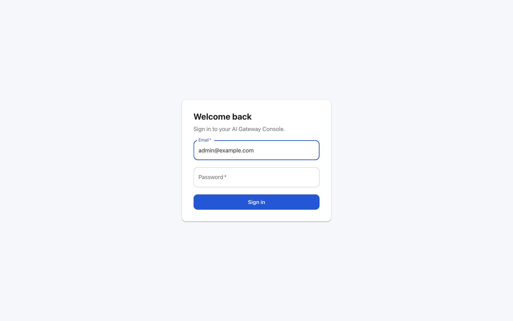

*Figure 9.1: The sign-in page.*

Enter your console email and password. Visitors who aren't signed in are sent
here from any console address. There is no sign-up link: accounts are created
by an administrator (section 9.16) or with `aigateway create-admin`.

### 9.5 Dashboard

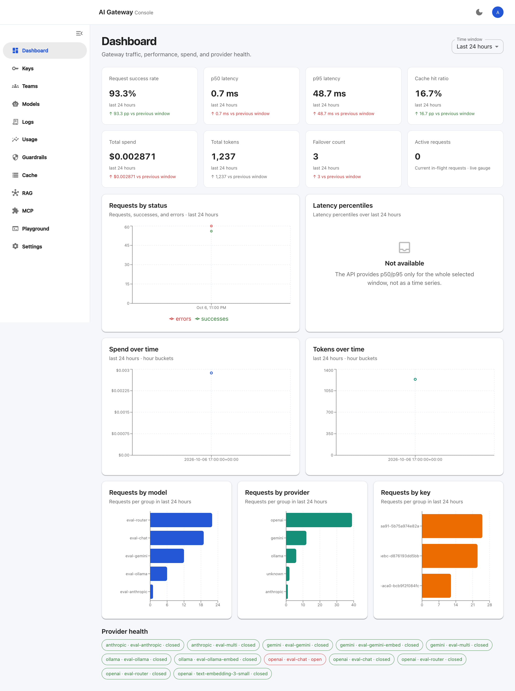

*Figure 9.2: The dashboard, showing the last 24 hours.*

The landing page answers "is the gateway healthy, and what is it costing?"

- **Top row:** request success rate, p50 and p95 latency, and cache hit ratio,
  each compared with the previous window.
- **Second row:** total spend, total tokens, **failover count** (requests the
  gateway rescued by switching deployment), and requests in flight right now.
- **Charts:** requests by status, spend and tokens over time, and requests
  broken down by model, provider, and key.
- **Provider health:** one chip per deployment with its circuit-breaker state.
  Green `closed` is healthy. Red `open` means the gateway is skipping that
  deployment until its cool-down ends. In Figure 9.2, `openai · eval-chat · open`
  is a deliberately dead deployment, and the failover count shows the gateway
  routing around it.

A card that says **Not available** means the metric isn't reported for that
window. It does not mean zero.

### 9.6 Keys

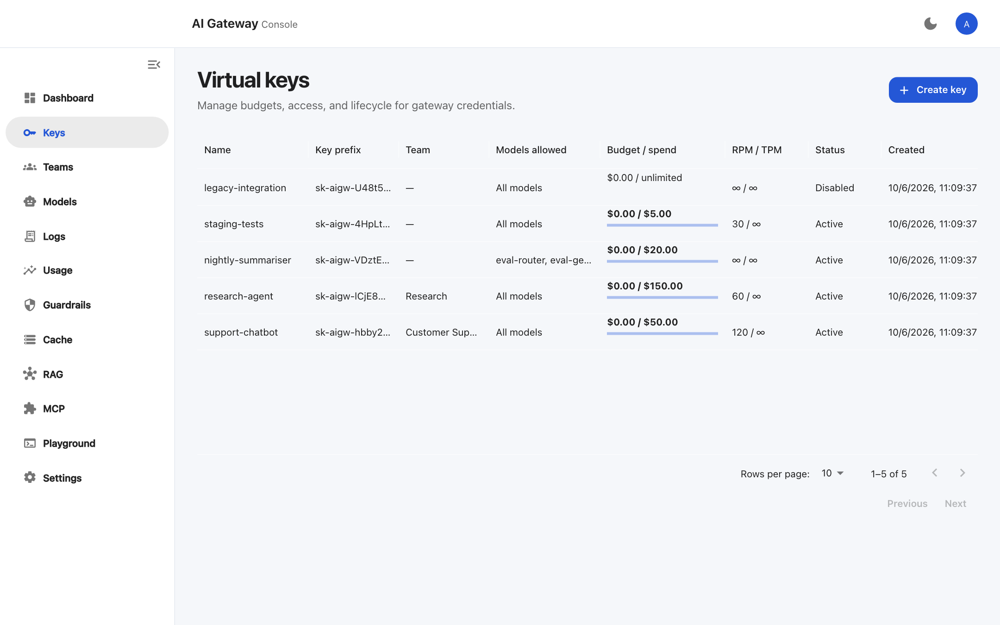

*Figure 9.3: Virtual keys, with their team, allowed models, budget use, rate limits, and status.*

Each row shows the key's name, the first characters of its secret (enough to
recognise it, not to use it), its team, allowed models, budget and spend,
rate limits, and whether it's **Active** or **Disabled**. Each row has action
buttons to **edit limits**, **regenerate** the secret, **disable** or
**enable** the key, and **delete** it.

**To create a key:**

1. Select **Create key**.
2. Enter a name. Optionally set a team, allowed models, allowed MCP servers and
   tools, a budget, and rate limits.
3. Select **Create**.

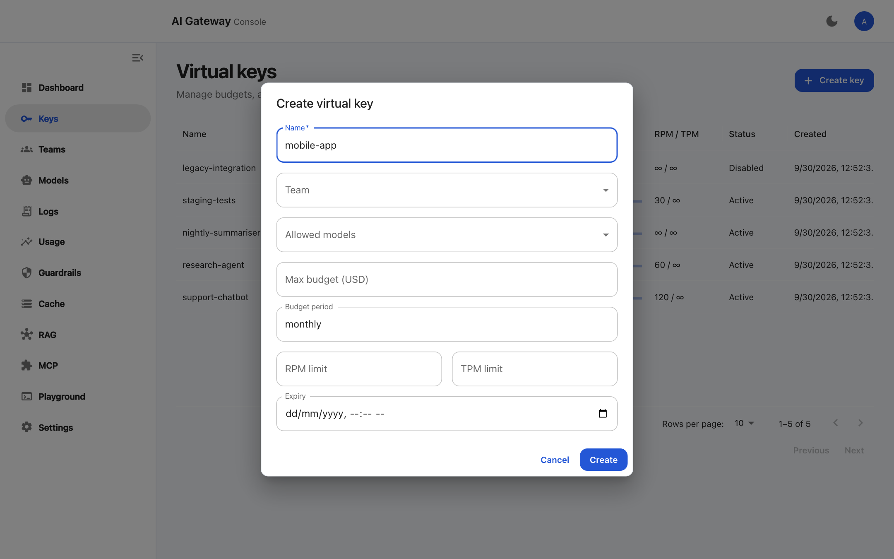

*Figure 9.4: Creating a key. Only the name is required; here the key may call only two tools.*

4. Copy the secret from the confirmation dialog, then select **Done**.

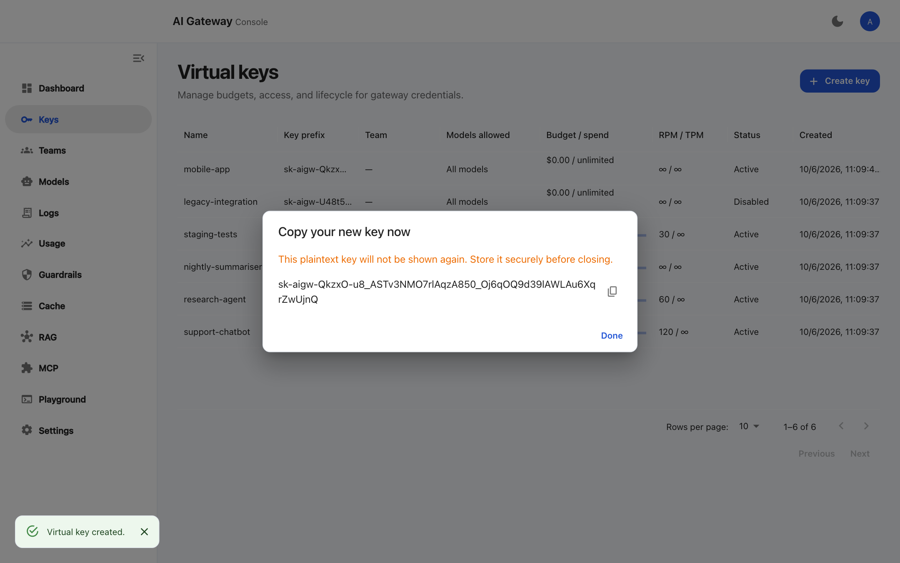

*Figure 9.5: The full secret is shown once. Only a hash is stored, so it cannot be shown again.*

Use **regenerate** for routine credential changes: it issues a new secret but
keeps the budget and history. Use **disable** or **delete** for a leaked key.

### 9.7 Teams

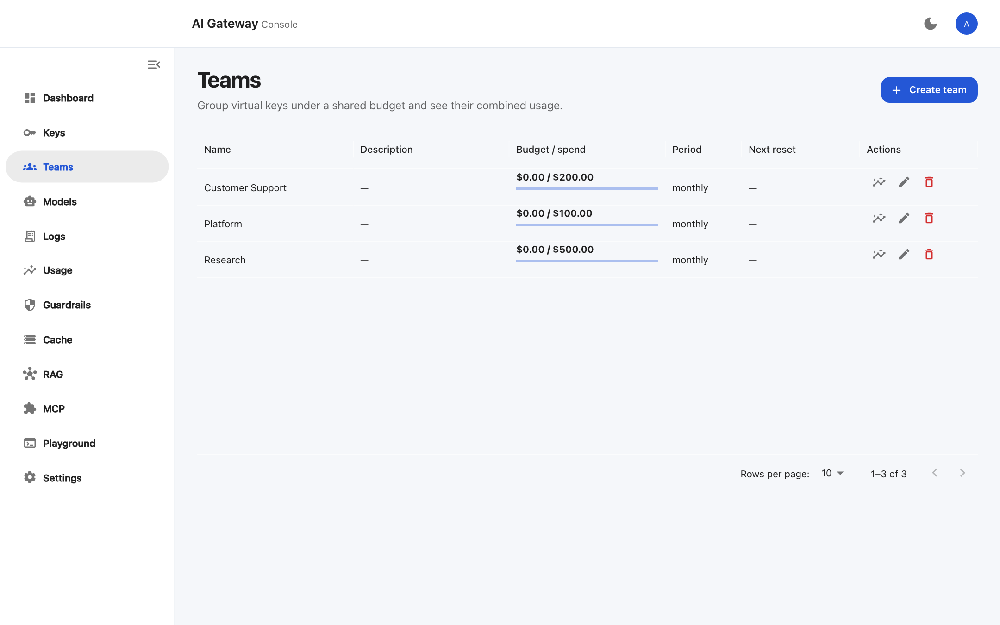

*Figure 9.6: Teams and their shared budgets.*

A team gives several keys one shared budget. The page lists each team's
budget, spend, and budget period. The usage button shows 30 days of requests,
tokens, and cost across the team's keys. Assign a key to a team when you create
or edit the key.

### 9.8 Models and routing

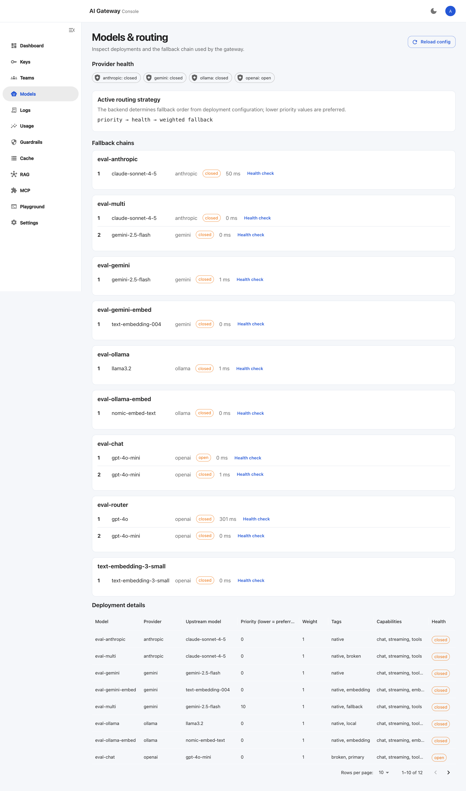

*Figure 9.7: Models & routing: provider health, the fallback chain for every model, and deployment details.*

This page shows what the gateway will do with a request for each model name:

- **Provider health**, summarised per provider.
- **Fallback chains:** for each model, the deployments in the order they will be
  tried (1 first), with the upstream model, provider, circuit-breaker state, and
  recent latency. **Health check** sends a real probe to that deployment, which is
  the quickest way to confirm a credential works.
- **Deployment details:** every deployment's priority, weight, tags, and
  capabilities.
- **Reload config** (top-right) re-reads the model catalogue without a restart.

In Figure 9.7, `eval-multi` falls back from an Anthropic deployment to a Gemini
one: a cross-provider fallback chain.

### 9.9 Logs

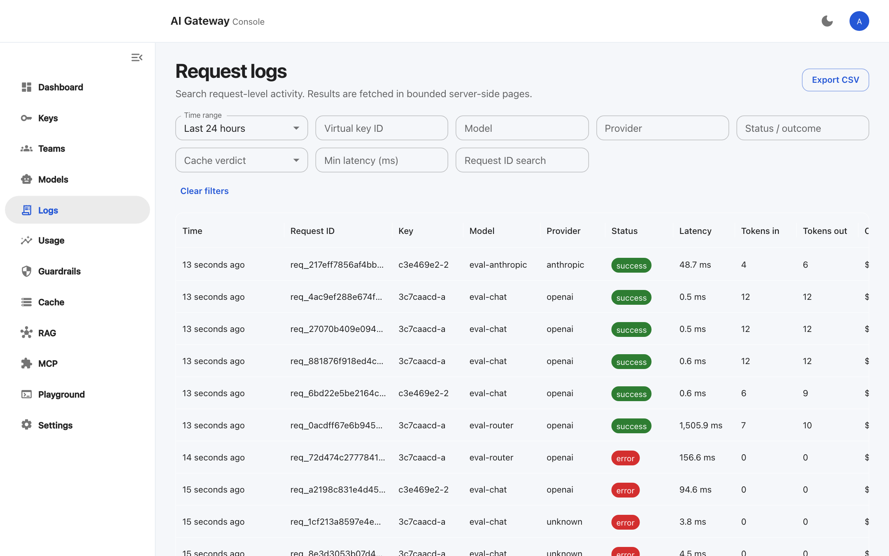

*Figure 9.8: The request log, newest first.*

Filter by time range, virtual key, model, provider, status, cache verdict,
minimum latency, or request ID. To find one specific request, paste the
`X-Gateway-Request-Id` header from its response into the request ID filter.
**Export CSV** downloads every row that matches the filters, not only the
visible page.

Select a row to open its details:

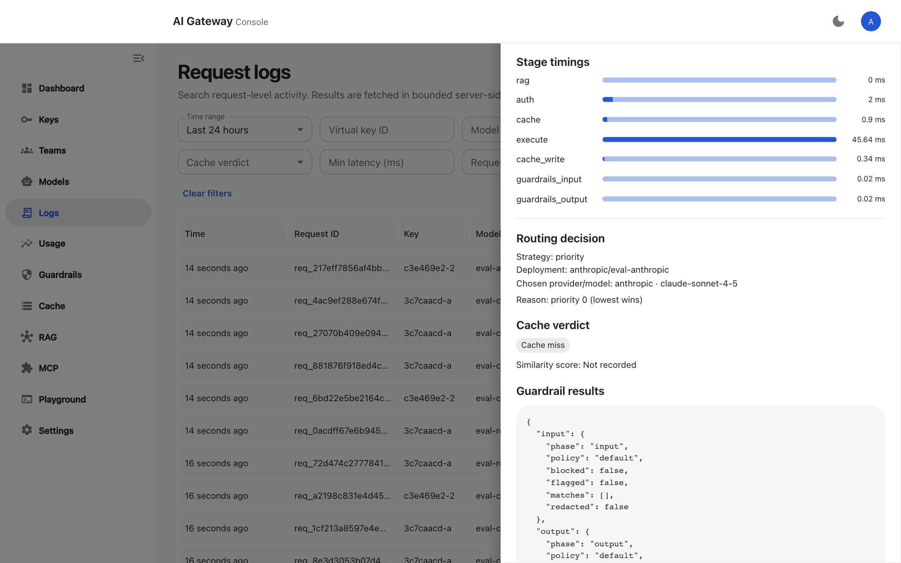

*Figure 9.9: A request's details: time spent in each pipeline stage, the routing decision, the cache verdict, and guardrail results.*

The panel shows:

- **Stage timings:** where the time went (auth, RAG, cache, the provider call,
  guardrails).
- **Routing decision:** the strategy, the deployment chosen, and why.
- **Cache verdict:** hit or miss, and the similarity score for a hit.
- **Guardrail results:** which rules ran and whether anything was blocked,
  redacted, or flagged.
- **Attempts:** every retry and fallback. A request that succeeded after two
  providers failed looks normal in the list; the attempts show that the gateway
  absorbed an outage.
- **Reveal:** prompt and reply bodies, when body logging is enabled and your
  role allows it.

### 9.10 Usage

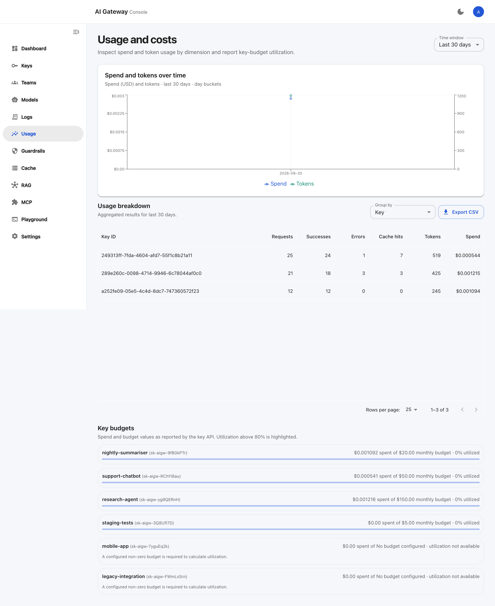

*Figure 9.10: Usage and costs over 30 days, grouped by key, with each key's budget use.*

- **Spend and tokens over time** for the selected window.
- **Usage breakdown:** requests, successes, errors, cache hits, tokens, and
  spend. Use **Group by** to choose key, model, provider, team, or day, and
  **Export CSV** for finance reports.
- **Key budgets:** each key's spend against its budget. Keys above 80% of their
  budget are highlighted.

Costs are estimates from the price table (section 10.5).

### 9.11 Guardrails

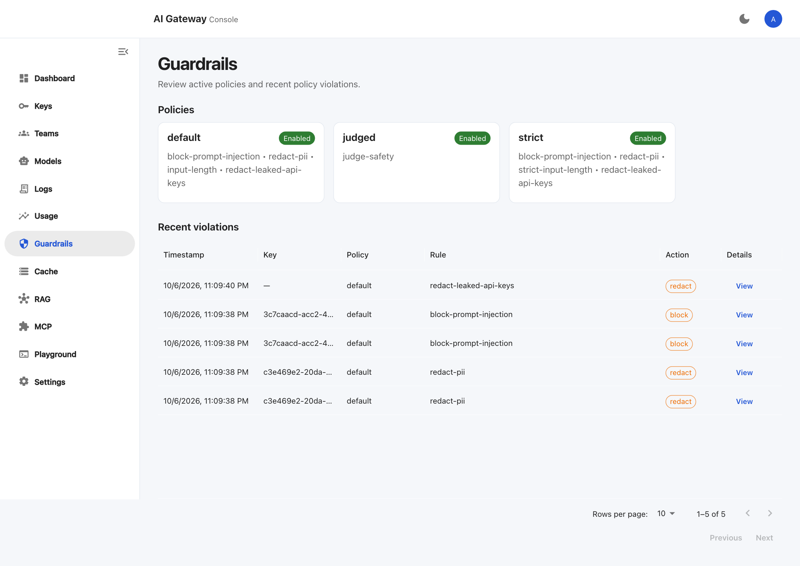

*Figure 9.11: Guardrail policies and recent violations.*

The **Policies** cards list each policy and its rules. **Recent violations**
shows each time a rule fired: when, which key, which policy and rule, and the
action taken (`block`, `redact`, or `flag`). Select **View** for the details.
Figure 9.11 shows two blocked prompt-injection attempts and two prompts where
personal data was redacted.

### 9.12 Cache

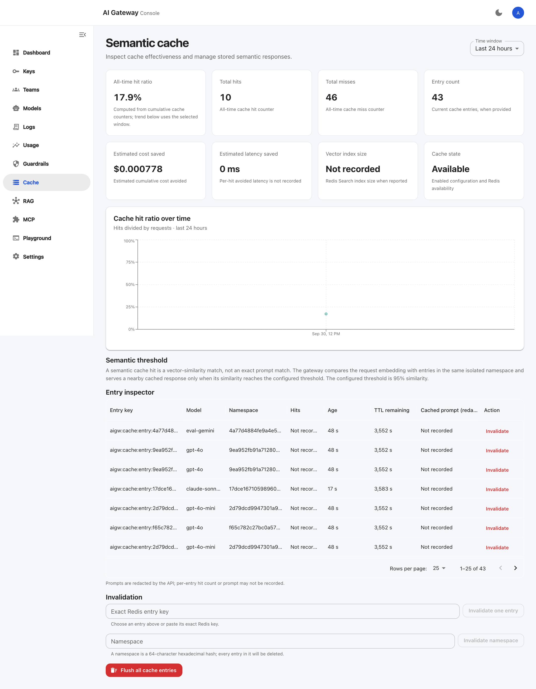

*Figure 9.12: The semantic cache: effectiveness, stored entries, and invalidation.*

- **Top cards:** hit ratio, hits, misses, entries, estimated cost saved, and
  whether the cache is available.
- **Cache hit ratio over time**, and the configured **semantic threshold**.
- **Entry inspector:** each stored answer with its model, namespace, age, and
  time to live. Select **Invalidate** to drop one entry.
- **Invalidation:** drop one entry by key, a whole **namespace** (do this after
  changing a system prompt), or **Flush all cache entries**.

### 9.13 RAG

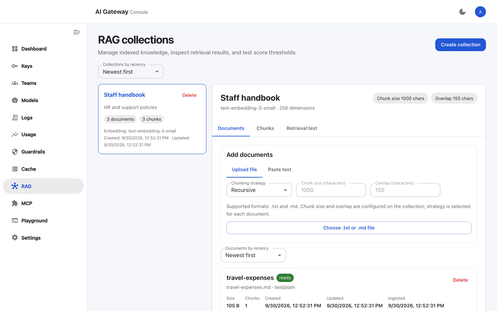

*Figure 9.13: A RAG collection and its documents.*

The left column lists collections. Select one to see its embedding model and
chunking settings, with three tabs:

- **Documents:** upload files or paste text, see each document's ingestion
  status, and delete documents. A document that fails to ingest shows the
  reason.
- **Chunks:** exactly what was indexed. Check here when retrieval returns
  something odd.
- **Retrieval test:** run a query and see the scored results before any
  application depends on the collection. Choose **Hybrid** (similarity plus
  keyword matching, the default) or **Vector**.

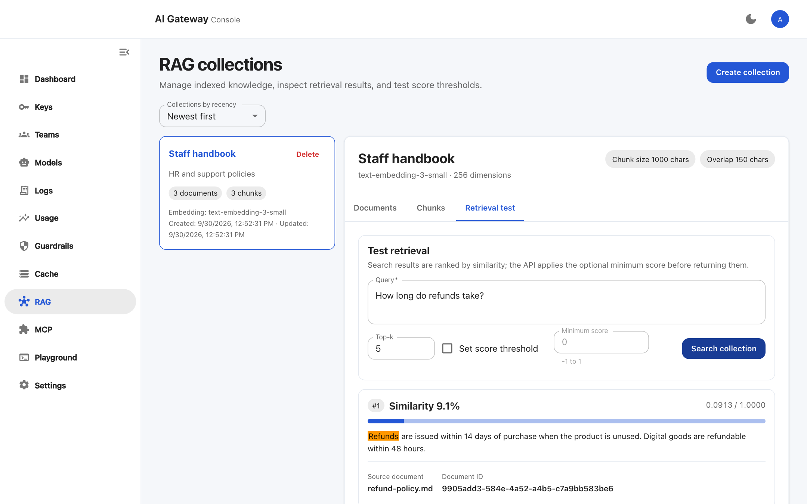

*Figure 9.14: A retrieval test in hybrid mode. The best-matching chunk is shown with its score and source document.*

### 9.14 MCP

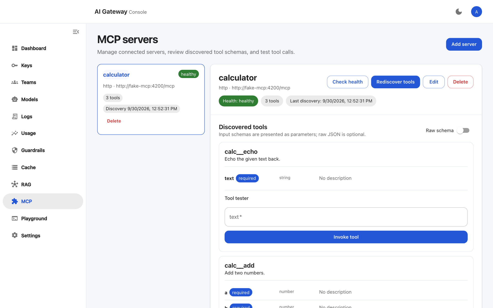

*Figure 9.15: An MCP server with its health and discovered tools.*

Select **Add server** to register an HTTP or stdio MCP server. Select a server
to see its health, when its tools were last discovered, and each tool's
parameters. The buttons at the top of the panel:

- **Check health** probes the server.
- **Rediscover tools** refreshes the tool list.
- **Edit** and **Delete** change or remove the server.

Each tool has a **tool tester**: fill in the parameters and select **Invoke
tool** to call it directly.

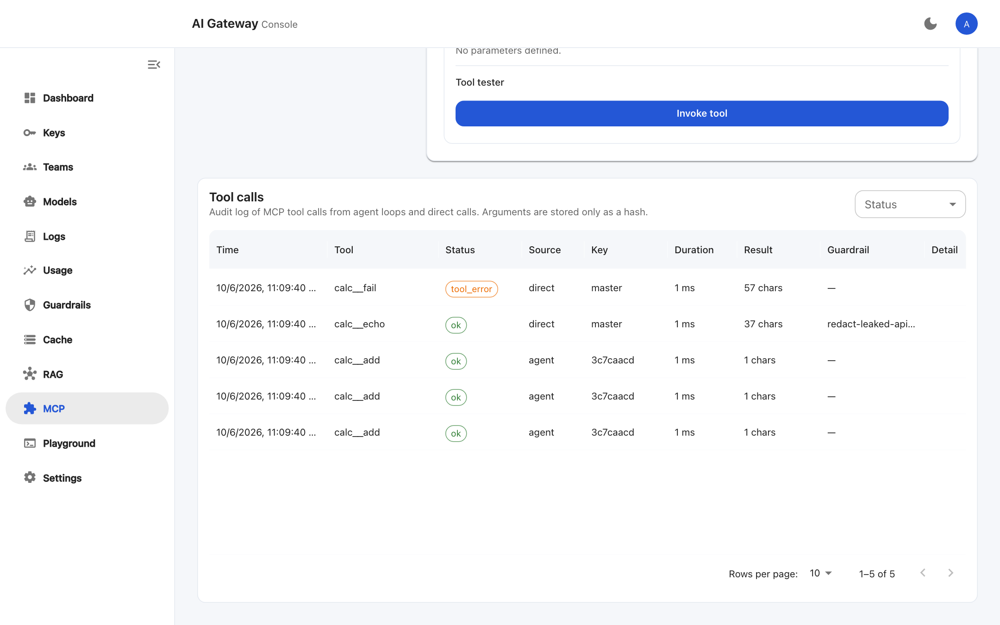

*Figure 9.16: The tool-call audit log: each call's tool, outcome, source (agent loop or direct), key, duration, result size, and any guardrail that acted. Here a secret in a tool result was redacted.*

Below the servers, **Tool calls** lists every MCP tool call. Filter by status:
`ok`, `tool_error` (the tool reported a failure), `failed` (the server could not
be reached), `denied` (outside the key's allowlist), `blocked` (a guardrail),
`invalid` (arguments did not match the schema), or `unavailable`.

### 9.15 Playground

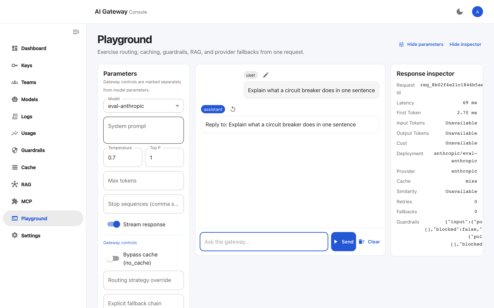

*Figure 9.17: The playground: parameters on the left, the conversation in the middle, and the response inspector on the right.*

Use the playground to try a model and see exactly how the gateway handled the
request. It is admin-only because it spends real money.

- **Parameters (left):** model, system prompt, temperature, top-p, max tokens,
  stop sequences, and streaming. Under **Gateway controls** you can bypass the
  cache, override the routing strategy, set a fallback chain, and choose a
  guardrail policy.
- **Conversation (middle):** type a message and press Enter or **Send**. Replies
  stream in as they're generated. Use the pencil to edit and resend a message,
  the arrow to regenerate a reply, and **Clear** to start again.
- **Response inspector (right):** the request ID, latency, time to first token,
  deployment and provider that answered, cache result, retries, fallbacks, and
  guardrail results.

Playground requests go through routing, guardrails, caching, and accounting
like any other request, and appear in **Logs**.

### 9.16 Settings

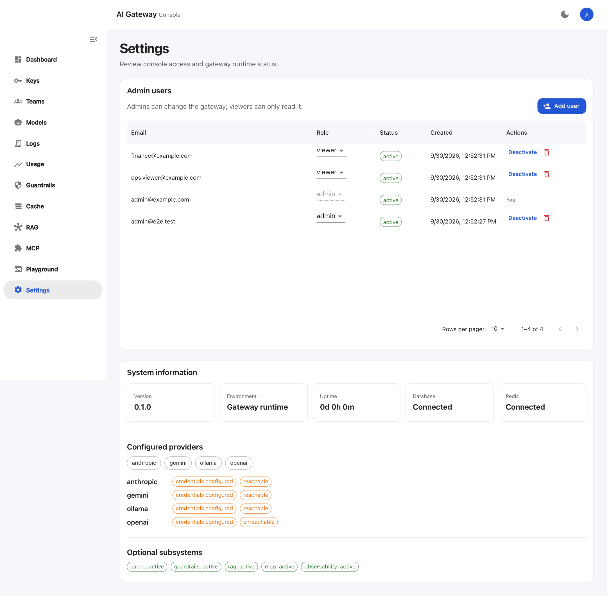

*Figure 9.18: Settings: console accounts, system information, provider status, and optional subsystems.*

- **Admin users:** select **Add user** to create an account; change a user's
  role in the **Role** column, or deactivate or delete them. Your own row is
  marked **You** and can't be demoted or deleted.
- **System information:** version, uptime, and whether the database and Redis
  are connected.
- **Configured providers:** whether each provider has credentials and is
  reachable. Secrets are never shown, and they can't be edited from the
  browser.
- **Optional subsystems:** whether the cache, guardrails, RAG, MCP, and
  observability are active.

---

## 10. Configuring models and routing

### 10.1 The model catalogue

Models are defined in `config/models.yaml` (path set by `MODELS_CONFIG_PATH`):

```yaml
model_list:
  - model_name: gpt-4o            # what clients ask for
    params:
      provider: openai            # openai | anthropic | gemini | ollama
      model: gpt-4o               # the provider's model id
      api_key: ${OPENAI_API_KEY}  # expanded from the environment
    priority: 1                   # LOWER number = tried first
    weight: 1
    tags: [premium]

  - model_name: gpt-4o            # same name: a fallback on another provider
    params:
      provider: anthropic
      model: claude-sonnet-4
      api_key: ${ANTHROPIC_API_KEY}
    priority: 2

aliases:
  gpt-4-turbo: gpt-4o             # keep old client names working
```

- Several deployments can share a model name. That is how fallback and load
  balancing work.
- `${VAR}` and `${VAR:-default}` read from the environment, so secrets stay out
  of the file.
- **`priority` is lowest-number-wins.** `priority: 0` is tried before
  `priority: 10`. Getting this backwards sends traffic to the wrong provider.
- Apply changes with **Models & routing → Reload config**, or
  `POST /admin/api/config/reload`.

### 10.2 Routing strategies

| Strategy | Picks | Good for |
|---|---|---|
| `priority` (default) | Lowest priority number | A clear first choice |
| `least-cost` | Cheapest for the request | Background and bulk work |
| `lowest-latency` | Fastest recently | Interactive use |
| `weighted` | Random, in proportion to `weight` | A/B tests, gradual rollouts |
| `conditional` | Based on the request (length, tools, tags) | Mixed workloads |

Set the default with `ROUTING_STRATEGY`; override per request with
`routing_strategy`.

### 10.3 How failures are handled

1. A retryable error (rate limit, timeout, 5xx) is **retried** on the same
   deployment, up to `MAX_RETRIES` times, with randomised backoff.
2. After that, or for errors like "context too long", the gateway **falls back**
   to the next deployment, up to `MAX_FALLBACKS`.
3. A deployment that fails `CIRCUIT_BREAKER_THRESHOLD` times in a row is
   **skipped** for `CIRCUIT_BREAKER_COOLDOWN_SECONDS`, then tested with one
   request.
4. **Streams fail over only before the first word is sent.** After that, an error
   ends the stream, because switching providers would mix two different answers.
5. An unknown model name is rejected with `404`. It is never silently served by
   another model.

### 10.4 Per-deployment limits

Give a deployment `rpm_limit` or `tpm_limit` (requests or tokens per minute) to
match your provider quota. When a deployment is full, traffic spills over to the
next one; when all are full, the client gets `429`.

### 10.5 Prices

Costs are estimated from per-million-token prices in `config/pricing.yaml` (or
`pricing` on a deployment). They are close enough to catch a runaway agent, but
will not match a provider invoice to the cent.

---

## 11. Controlling cost and access

### 11.1 Limits on a virtual key

| Limit | Effect when reached |
|---|---|
| **Budget** (USD, optionally per period) | Requests refused with `402 budget_exceeded` |
| **Requests / tokens per minute** | `429 rate_limit_exceeded` |
| **Requests in flight** | Extra concurrent requests get `429` |
| **Allowed models** | Other models get `403`; empty list means all |
| **Allowed routes** | Restrict a key to, for example, embeddings only |
| **Allowed MCP servers / tools** | Other servers' tools are hidden and refused (section 8.3) |
| **Expiry** | The key stops working after the date |

### 11.2 Teams

Put keys in a team to share one budget across them. A request must fit both the
key's and the team's budget. Deleting a team keeps its keys working; they stop
sharing its budget.

### 11.3 Good practice

- Give each application its own key, so usage and failures are attributable.
- Keep the master key for administration; never ship it in an application.
- Regenerate keys on a schedule; disable immediately if one leaks.

---

## 12. Guardrails

Policies live in `config/guardrails.yaml`. A `default` policy is required; keys
can be bound to others, and requests can choose one with `guardrail_policy`.
A policy with `apply_to_tools: true` also screens MCP tool arguments and
results (the shipped `default` and `strict` policies do).

```yaml
policies:
  default:
    input:
      - type: pii
        action: redact            # block | redact | flag
        entities: [email, phone, credit_card, ssn]
      - type: denylist
        action: block
        terms: [...]
    output:
      - type: pii
        action: redact
```

| Rule type | Checks for |
|---|---|
| `pii` | Emails, phone numbers, card numbers, national IDs |
| `regex` | Any pattern you define |
| `denylist` | Forbidden words or phrases |
| `llm_judge` | A model scores the text against a policy written in plain language |

| Action | Effect |
|---|---|
| `block` | Refuse with `422 guardrail_violation` |
| `redact` | Replace the matched text and continue |
| `flag` | Allow, but record a violation |

- Output rules also apply to **streamed** replies. The gateway holds back the
  last 128 characters (`GUARDRAILS_STREAM_HOLDBACK_CHARS`), so a match split
  across chunks is still caught.
- An `llm_judge` rule adds a model call to every request under that policy; bind
  it only to the keys that need it. `on_error` chooses whether a judge failure
  allows or blocks.
- Watch the violation feed. A rule that constantly fires on normal traffic
  teaches people to work around it.

---

## 13. Semantic cache

The cache answers a request from a stored reply when the question is close
enough in meaning to one asked before, not only when the text is identical.

- **Threshold:** `CACHE_SIMILARITY_THRESHOLD` (default 0.95). Lowering it raises
  the hit rate *and* the risk of answering a question nobody asked. Treat it as a
  correctness setting.
- **Scope:** entries only match within the same model, key or team, system
  prompt, temperature range, response format, and tool set.
- **Not cached:** tool calls, and replies generated above
  `CACHE_MAX_TEMPERATURE` (default 0.3).
- **Skip it:** send `no_cache: true`.
- **After changing a system prompt**, invalidate that namespace from the Cache
  page; old answers are now wrong in a way no expiry time will catch.

---

## 14. Monitoring

| Signal | Where |
|---|---|
| Metrics | Prometheus at `/metrics` (enable with `METRICS_ENABLED`) |
| Dashboards | Grafana, preconfigured in the Docker Compose stack |
| Traces | OpenTelemetry to `OTLP_ENDPOINT` (enable with `TRACING_ENABLED`) |
| Logs | Structured JSON (`LOG_FORMAT=json`) |
| Per-request history | Console **Logs** page |

Prompt and reply bodies are logged only if `LOG_REQUEST_BODIES=true`, and are
shown in the console only behind an explicit **reveal**.

RAG and MCP have their own metrics: `aigw_rag_retrievals_total` (with empty
results), `aigw_rag_ingestions_total` (including failures), latency histograms,
`aigw_mcp_tool_calls_total` by server, tool, and outcome, and
`aigw_mcp_breaker_open` per server.

**Worth alerting on:** a deployment's or MCP server's circuit breaker staying
open; a falling success rate; spend rising faster than usual; a cache hit ratio
suddenly dropping to zero; RAG searches returning nothing more often than usual.

---

## 15. Errors and what to do about them

Errors come back in the envelope of the dialect you used (OpenAI or Anthropic)
with a stable `code`.

| HTTP | Code | Meaning | What to do |
|---|---|---|---|
| 400 | `invalid_request` | The request is malformed | Fix the request body |
| 400 | `context_length_exceeded` | Too long for every candidate model | Shorten the input, or add a larger model as a fallback |
| 401 | `authentication_error` | Missing, wrong, or disabled key | Check the key and header |
| 402 | `budget_exceeded` | Key or team budget used up | Raise the budget or wait for the next period |
| 403 | `permission_denied` | Model or route not allowed for this key | Update the key's allowlist |
| 404 | `not_found` | Unknown model or resource | Check the model name in `/v1/models` |
| 422 | `guardrail_violation` | Blocked by a guardrail | Rephrase, or review the policy |
| 429 | `rate_limit_exceeded` | Key limit or deployment capacity reached | Back off and retry |
| 502 | `all_providers_failed` | Every deployment failed | Check provider health on the dashboard |
| 503 | `no_healthy_deployment` | Every deployment is unavailable | Check provider credentials and status |
| 503 | `rag_unavailable` | The RAG store is unreachable | Check Redis |

---

## 16. Troubleshooting

| Symptom | Likely cause and fix |
|---|---|
| `/ui` returns 404 | Console not built. Run `cd ui && npm run build`, or use the Docker image. |
| Cannot sign in on a new deployment | The bootstrap admin is only created when no accounts exist. Use `aigateway create-admin`. |
| Everyone signed out after a restart | `JWT_SECRET` changed. Set it explicitly and identically on all replicas. |
| Requests are slow and costly | A primary deployment's breaker is `open` and traffic is on the fallback. Check the dashboard's provider health. |
| Cache never hits | Check `CACHE_ENABLED`, that Redis is **Redis Stack**, and that `CACHE_EMBEDDING_DIMENSIONS` matches the embedding model. |
| Cache returns the wrong answer | The threshold is too low, or the system prompt changed: raise the threshold or invalidate the namespace. |
| A provider shows no credential in Settings | Set its `*_API_KEY` in the environment and restart. Keys cannot be edited from the browser, by design. |
| Ollama model not found | Pull it on the Ollama host: `ollama pull <model>`. |
| MCP server registration fails | The console shows the reason: an unreachable URL, a command not on `PATH`, or a failed handshake. |
| Tool calls fail with "calls are paused" | The server's circuit breaker opened after repeated failures; it retries automatically. Refresh the server to see its error output. |
| The gateway will not start: "SECRETS_ENCRYPTION_KEY" | Stored MCP credentials are encrypted and the key is missing or wrong. Restore the key (keep old keys listed after the new one when rotating). |
| RAG searches return nothing after a Redis restart | Check `GET …/collections/<id>/index`; if it is not in sync, `POST …/reindex`. |
| A document stays `failed` with "interrupted by a gateway restart" | It was being ingested when the gateway stopped; upload it again. |

---

## 17. Reference: settings

The most commonly changed settings. Every setting is an environment variable.

| Setting | Default | Purpose |
|---|---|---|
| `DATABASE_URL` | local Postgres | Postgres connection (`postgresql+asyncpg://…`) |
| `REDIS_URL` | `redis://localhost:6379/0` | Redis Stack connection |
| `MASTER_KEY` | — | Root API key |
| `JWT_SECRET` | — | Console session signing key (≥ 32 bytes) |
| `OPENAI_API_KEY`, `ANTHROPIC_API_KEY`, `GEMINI_API_KEY` | — | Provider credentials |
| `OLLAMA_BASE_URL` | — | Ollama server |
| `MODELS_CONFIG_PATH` | `config/models.yaml` | Model catalogue |
| `ROUTING_STRATEGY` | `priority` | Default routing strategy |
| `MAX_RETRIES` | `2` | Retries per deployment |
| `MAX_FALLBACKS` | `3` | Deployments tried before giving up |
| `REQUEST_TIMEOUT_SECONDS` | `120` | Whole-request timeout |
| `CIRCUIT_BREAKER_THRESHOLD` | `5` | Failures before a deployment is skipped |
| `CIRCUIT_BREAKER_COOLDOWN_SECONDS` | `30` | How long it is skipped |
| `CACHE_ENABLED` | `true` | Semantic cache on or off |
| `CACHE_SIMILARITY_THRESHOLD` | `0.95` | How close a question must be to hit |
| `CACHE_TTL_SECONDS` | `3600` | Cache entry lifetime |
| `GUARDRAILS_ENABLED` | `true` | Guardrails on or off |
| `LOG_REQUEST_BODIES` | `false` | Log prompts and replies (privacy-sensitive) |
| `METRICS_ENABLED` | `true` | Prometheus metrics |
| `TRACING_ENABLED` | `false` | OpenTelemetry traces |
| `JWT_ACCESS_TTL_SECONDS` | `3600` | Console sign-in length |
| `UI_ENABLED` | `true` | Serve the console |
| `SECRETS_ENCRYPTION_KEY` | — | Encrypts stored MCP server credentials |
| `MCP_MAX_RESULT_CHARS` | `20000` | Longest tool result passed to the model |
| `MCP_HEALTH_INTERVAL_SECONDS` | `60` | Background MCP health checks (`0` disables) |
| `RAG_MAX_DOCUMENT_BYTES` | `10000000` | Largest document accepted |
| `RAG_BACKGROUND_INGEST_BYTES` | `200000` | Documents this large ingest in the background |

The full list is in [docs/configuration.md](configuration.md).
